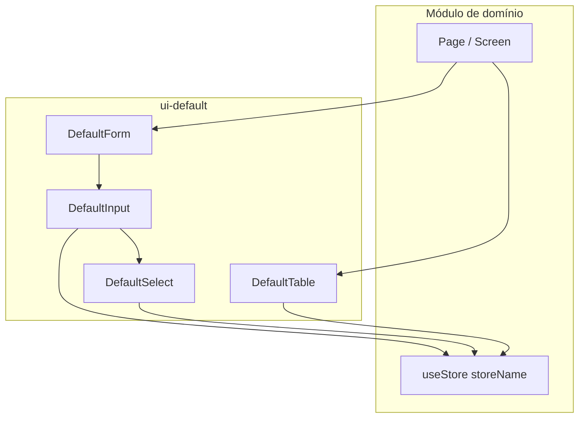

# Componentes Default* (`ui-default`)

Documentação técnica da família de componentes genéricos do módulo **`ControleOnline/ui-default`**.

> Público: desenvolvedores e agents internos.  
> Issue: `ControleOnline/ui-default#2`.

## Objetivo do módulo

`ui-default` concentra UI reutilizável orientada a **stores** (`useStore(storeName)`): tabelas, formulários, inputs, filtros, upload, mapas e anexos. O contrato central é a **definição de colunas** (`columns`) + estado do store (`items`, `filters`, `configs`, `actions`).

## Mapa de componentes

| Família | Componentes principais | Pasta |
| --- | --- | --- |
| Tabela | `DefaultTable`, Body, Rows, Cards, Toolbar, Footer, Search, Controls… | `src/react/components/table/` |
| Formulário | `DefaultForm` | `src/react/components/form/` |
| Inputs | `DefaultInput`, `DefaultSelect`, `DefaultDateInput`, `DefaultColorInput`, `DefaultFeatherIconPicker` | `src/react/components/inputs/` |
| Filtros | `DefaultSearch`, `DefaultColumnFilter`, `DefaultExternalFilters`, `DateShortcutFilter`, `CompactFilterSelector` | `src/react/components/filters/` |
| Arquivos | `DefaultFile`, `DefaultFileColumn` | `src/react/components/files/` |
| Upload | `DefaultUpload` | `src/react/components/upload/` |
| Extra | `DefaultExtraData` | `src/react/components/extra-data/` |
| Erros | `DefaultErrors` | `src/react/components/errors/` |
| Ajuda | `DefaultTooltip` | `src/react/components/help/` |
| Mapa | `DefaultMap`, `DefaultGoogleMap`, `DefaultNativeMap` | `src/react/components/map/` |

## Páginas detalhadas

| Página | Conteúdo |
| --- | --- |
| [DefaultTable](DefaultTable) | Orquestração, props, store contract, view modes, preferências |
| [DefaultForm](DefaultForm) | Create/edit, draft, payload de save |
| [DefaultInput-e-DefaultSelect](DefaultInput-e-DefaultSelect) | Roteamento por tipo de coluna, list remote, apresentação |
| [Contrato-de-colunas](Contrato-de-colunas) | Flags e helpers de `defaultInputUtils` |

## Dependências transversais

- `@store` — `useStore` / `getAllStores`
- `@controleonline/ui-common` — `MessageService`, `Formatter`, `formatStoreColumnLabel` / `formatStoreColumnValue`, date range helpers
- `@react-navigation/native` — foco e escopo de preferências da tabela
- Tema via store `theme` e tokens em `useDefaultTableTheme`

## Quando usar

| Situação | Preferir |
| --- | --- |
| Listagem CRUD ligada a store com `getItems` / `save` | `DefaultTable` (+ `DefaultForm` no modal de add/edit) |
| Campo isolado em tela custom | `DefaultInput` / `DefaultSelect` |
| Upload de arquivos | `DefaultUpload` |
| Mapa web/native | família `DefaultMap*` |

## Não objetivos

- Não substituir telas de domínio com regras de negócio específicas sem `columns`/`store`.
- Não publicar esta documentação na Central de Ajuda do cliente (`tutorial-assistant`); é documentação **técnica**.
