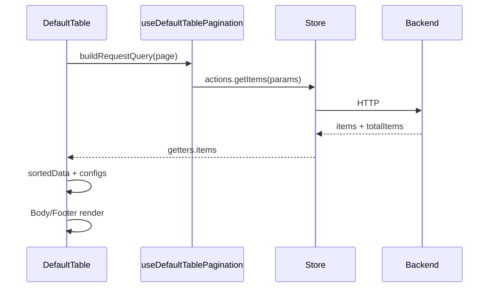
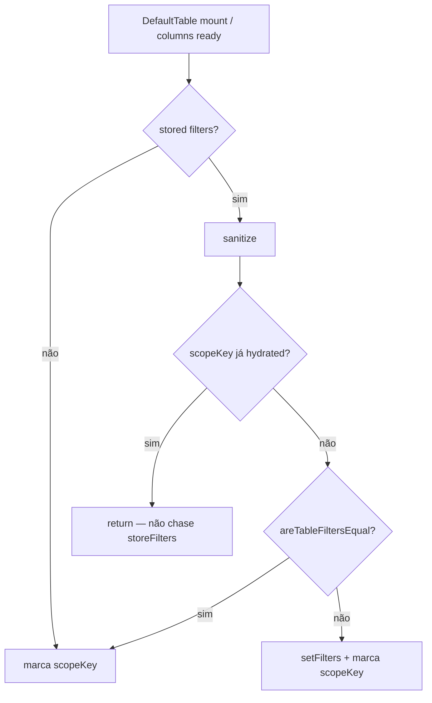

# DefaultTable

Componente orquestrador de listagens genéricas em React Native / RN Web.

**Arquivo:** `src/react/components/table/DefaultTable.js`  
**Composição:** `DefaultTableToolbar` → `DefaultTableBody` → `DefaultTableFooter` (+ botões de add)

## Responsabilidade

1. Resolver **colunas** (store ou prop).
2. Em **autoMode** (`data === undefined` e `storeName` preenchido), paginar/ordenar/filtrar via `store.actions`.
3. Publicar um objeto **`configs`** no store para filhos lerem sem prop-drilling.
4. Persistir preferências (colunas visíveis, filtros, view mode, sort) por escopo **empresa / store / rota**.

## Auto mode vs dados controlados

| Modo | Condição | Comportamento |
| --- | --- | --- |
| **autoMode** | `data === undefined` e `storeName` não vazio | Pagination hook chama actions do store; `items` / `totalItems` vêm do store |
| **Controlado** | `data` é array | `items` do store são sobrescritos com `data`; refresh/endReached podem ser callbacks externos |

## Props (principais)

| Prop | Tipo / default | Função |
| --- | --- | --- |
| `storeName` | string | Nome do store (`useStore`) |
| `columns` | array | Fallback se `store.getters.columns` vazio |
| `data` | array \| undefined | Dados controlados; `undefined` ativa autoMode |
| `actions` | object | Merge sobre `store.actions` |
| `filters` | object | Filtros iniciais / seed |
| `requestParams` | object | Params extras em toda request |
| `pageSize` | number \| null | Tamanho de página |
| `sort` | `{ field, direction }` \| null | Sort controlado |
| `onSortChange` | fn | Callback de sort |
| `hasMore` / `onEndReached` | | Infinite scroll |
| `isLoading` / `onRefresh` | | Pull-to-refresh |
| `initialViewMode` | `'table'` \| `'cards'` | Preferência inicial |
| `forceCardsOnCompact` | true | Cards quando `width <= compactBreakpoint` |
| `compactBreakpoint` | 768 | Breakpoint de compactação |
| `showToolbar` / `showSearch` / `showRowActions` | | UI chrome |
| `showColumnFiltersButton` | true | Botão de filtros de coluna |
| `add` / `onAdd` / `addLabel` / `addButtonPlacement` | | `'toolbar'` \| `'bottom'` \| `'floating'` |
| `importAction` / `onImport` / `exportAction` / `onExport` | | Import/export |
| `onRowPress` / `onEditRow` / `onSaved` | | Interação de linha |
| `rowActionsComponent` / `rowActionsWidth` / `pinRowActions` | | Ações por linha |
| `renderCard` / `cardListProps` | | Customização de cards |
| `summary` / `summaryLabels` | | Rodapé agregado |
| `footerComponent` | | Slot de footer |
| `toolbarActions` | array | Ações extras na toolbar |
| `getOptionsForColumn` | fn | Options locais para selects |
| `searchKey` | `'search'` | Param de busca textual |
| `searchPlaceholder` | string | Placeholder |
| `visibleColumnsPreferenceKey` | string | Chave extra de preferência |
| `accentColor` / `defaultColor` | | Tema / cor padrão de campos cor |
| `rowStyle` | | Estilo por linha |

## Contrato do store

Esperado em `useStore(storeName)`:

| Getter / action | Uso |
| --- | --- |
| `getters.columns` | Definição de colunas (preferencial) |
| `getters.items` | Linhas |
| `getters.totalItems` | Paginação |
| `getters.filters` | Filtros ativos |
| `getters.visibleColumns` | Mapa de colunas visíveis |
| `getters.configs` | Publicado pelo `DefaultTable` para filhos |
| `getters.add` | Se `true`, habilita add com `actions.save` ou `onAdd` |
| `actions.getItems` (ou equivalente na paginação) | Load |
| `actions.save` | Persistência (form/inline) |
| `actions.setColumns` / `setItems` / `setFilters` / `setVisibleColumns` / `setConfigs` | Preferidos; senão muta getters |

Helpers de publicação interna: `publishStoreValue` / `assignGetterValue`.

### Objeto `configs` (publicação)

O table monta `defaultTableConfigs` e grava em `store.getters.configs`, incluindo: view mode efetivo, sort resolvido, callbacks de refresh/endReached, flags de UI, `sortedData`, `debugFallbackParameters`, preferência scope, etc. Filhos (`Toolbar`, `Body`, `Footer`) leem **só** `storeName` e usam `configs`.

## View modes

1. Preferência persistida (`resolveStoredTableViewModePreference`)
2. `configs.viewMode` corrente
3. Compacto: se `width <= compactBreakpoint` e `forceCardsOnCompact`, força `'cards'`
4. Senão `initialViewMode` (default `'table'`)

`DefaultTableBody` escolhe `DefaultTableRows` vs `DefaultTableCards`.

## Preferências persistidas (escopo por empresa)

Escopo via `resolveDefaultTablePreferenceScope({ companyId, preferenceKey, route, storeName })`.

Estrutura no `localStorage` (chave raiz `default-table`):

```text
default-table[companyKey][storeKey][routeKey] = {
  visibleColumns,
  filters,
  viewMode,
  sort
}
```

- `companyKey` = identificador estável da empresa ativa (normalizado).
- `storeKey` = nome do store (`storeName`).
- `routeKey` = `preferenceKey` explícito, pathname, `route.name` ou `route.key`.

**O que é persistido:** colunas visíveis, filtros de tabela, view mode e sort.

**Sanitização:** `sanitizeVisibleColumnsPreference` / `sanitizeTableFiltersPreference` (só campos de colunas filtráveis + `search`; ignora chaves desconhecidas ou bloqueadas com `filter: false`).

### Comportamento na troca de empresa

1. O escopo muda (`companyKey` novo).
2. Filtros, colunas, sort e view mode da empresa anterior **não** são reutilizados.
3. O table hidrata as preferências salvas para a nova empresa (ou defaults se não houver).
4. Listas/opções de filtros (selects de coluna e filtros externos) devem ser **recarregadas** no contexto da empresa ativa — não reutilizar opções carregadas para a empresa anterior.
5. Stores e rotas diferentes continuam isolados entre si.

**Compatibilidade com formato legado:** preferências antigas no formato `default-table[store][route]` (sem `companyKey`) **não** são copiadas automaticamente para todas as empresas. Escopos sem `companyKey` são ignorados na leitura/gravação (ver testes em `tableVisibleColumnsPreferences.test.js`).

Referência de implementação: `src/react/utils/tableVisibleColumnsPreferences.js`.

## Paginação e sort

- `useDefaultTablePagination` — monta query (`buildRequestQuery`), página corrente, refresh, end reached
- `useDefaultTableSortState` / `useDefaultTableSortedData` — sort remoto/local
- Utils: `resolveDefaultSort`, `isSortableColumn`, `getSortField`, `mergeSortedDataWithLiveItems`

Constantes úteis (`DefaultTable.utils.js`):

- `DEFAULT_COMPACT_BREAKPOINT = 768`
- `END_REACHED_THRESHOLD = 0.75`
- larguras mínimas de célula (identity / money / default)

## Composição interna

| Peça | Papel |
| --- | --- |
| `DefaultTableToolbar` | Search, controles, import modal, ações |
| `DefaultTableControls` | Column menu, filters modal, debug |
| `DefaultTableSearch` / `DefaultSearchModal` | Busca (compacta ou modal) |
| `DefaultTableRows` | Cabeçalho, filtros por coluna, células, inline edit |
| `DefaultTableCards` | Layout card + `renderCard` opcional |
| `DefaultTableInput` | Ponte célula → `DefaultInput` |
| `DefaultTableFooter` | Totais / summary / paginação visual |
| `DefaultTableEmptyState` | Empty + `StateStore` |
| `DefaultTableRowActions` | Slot de ações |
| `useDefaultTableTheme` | Cores de painel/borda/botão a partir do theme store |

## Fluxo de dados (autoMode)



## Integração mínima

```jsx
<DefaultTable
  storeName="customers"
  onAdd={() => openCreateModal()}
  onRowPress={(row) => openDetails(row)}
/>
```

Com colunas só via prop (store ainda sem columns):

```jsx
<DefaultTable
  storeName="customers"
  columns={[
    { name: 'id', label: 'ID', isIdentity: true, editable: false },
    { name: 'name', label: 'Nome', editable: true },
    { name: 'status', label: 'Status', list: 'status/getItems', editable: true },
  ]}
/>
```


## Sincronização com o store (`useDefaultTableStoreSync`)

Hook interno que mantém props controladas do `DefaultTable` alinhadas ao slice Zustand **sem depender da identidade do objeto `store`** (Zustand troca a referência a cada commit).

**Arquivo:** `src/react/components/table/useDefaultTableStoreSync.js`  
**Testes:** `src/tests/react/components/table/useDefaultTableStoreSync.test.js`

### O que sincroniza

| Efeito | Origem → destino | Guard anti-loop |
| --- | --- | --- |
| Colunas | prop `columns` → `actions.setColumns` / `getters.columns` | só se o store ainda não tiver colunas |
| Itens controlados | prop `data` → `actions.setItems` | mesma referência de array (`lastPublishedItemsRef`) |
| Colunas visíveis | `localStorage` (escopo empresa/store/rota) → `setVisibleColumns` | sanitização por colunas atuais |
| Filtros persistidos | `localStorage` → `setFilters` | **hydrate uma vez por scopeKey** + `areTableFiltersEqual` |
| Configs | `defaultTableConfigs` → `setConfigs` | assinatura estável (`defaultTableConfigsSignature`) |

Helpers exportados: `publishStoreValue`, `assignGetterValue`, `areTableFiltersEqual`.

### Preferências de filtro — regra de hydrate único

Filtros de tabela são lidos de `resolveStoredTableFiltersPreference(tablePreferenceScope)` e aplicados via `sanitizeTableFiltersPreference`.

**`scopeKey`** (estável):

```text
companyKey :: storeKey :: routeKey :: colunas(key|name)|...
```

Regras canônicas (app-community#448 / ui-orders OrderHistoryPage):

1. Hydrate de filtros persistidos ocorre **no máximo uma vez** por `scopeKey` (`lastHydratedFiltersKeyRef`).
2. **Não** reagir a mudanças de `storeFilters` após o hydrate — perseguir o store recria o payload e gera React **#185** (Maximum update depth exceeded).
3. Antes de `setFilters`, comparar com `areTableFiltersEqual` (JSON estável). Se já for equivalente, só marca o `scopeKey` e sai.
4. Toggle típico que quebrava: período `today → all → today` em `OrderHistoryPage` (filtro externo de data + DefaultTable). O guard em `useOrderHistoryFilters` (`areHistoryFiltersEqual`) **não basta** se o loop nascer no hydrate do DefaultTable.



### Por que não colocar `storeFilters` nas deps

Incluir `storeFilters` no array de dependências do efeito de hydrate faz:

`setFilters` → nova referência no store → efeito roda de novo → `setFilters` → **#185**.

A correção remove `storeFilters` das deps e usa `storeFiltersRef` só para a comparação de igualdade no momento do hydrate.

### Visões (`APP_TYPE`)

`ui-default` **não** conhece domínio de pedido/CRM/POS. Qualquer tela que use `DefaultTable` + filtros de período (ex.: histórico de pedidos em `ui-orders`, listagens CRM) herda este contrato. O módulo consumidor não deve reaplicar filtros persistidos em todo change do store; o orquestrador já faz o hydrate único.

### Testes mínimos esperados

- Publicação de `data` uma vez por referência de array (Devices / #185 histórico).
- Hydrate de filtros uma vez; após churn de `storeFilters` (simular today→all→today), `setFilters` continua 1×.
- `areTableFiltersEqual` trata payloads de período equivalentes como iguais.

## Limites e cuidados

- Filhos dependem de `configs` no store: não renderize Body isolado sem o orquestrador.
- Preferências são por **empresa + store + rota**: mudou empresa ou rota, o escopo muda.
- `stableSerialize` evita loops de `setConfigs`.
- Hydrate de filtros persistidos é **único por scopeKey** — não recoloque `storeFilters` nas deps do efeito de hydrate (React #185; ver seção `useDefaultTableStoreSync`).
- List stores com escopo de empresa (`categories`, `paymentType`, `wallet`) recebem `company`/`people` automaticamente nos loads de select/coluna.

## Arquivos relacionados

- `DefaultTable.js`, `DefaultTable.utils.js`, `DefaultTable.styles.js`
- Hooks: `useDefaultTablePagination.js`, `useDefaultTableSorting.js`, `useDefaultTableTheme.js`, **`useDefaultTableStoreSync.js`**
- Preferências: `src/react/utils/tableVisibleColumnsPreferences`
- Testes: `src/tests/react/utils/tableVisibleColumnsPreferences.test.js`
- Testes store sync: `src/tests/react/components/table/useDefaultTableStoreSync.test.js`
